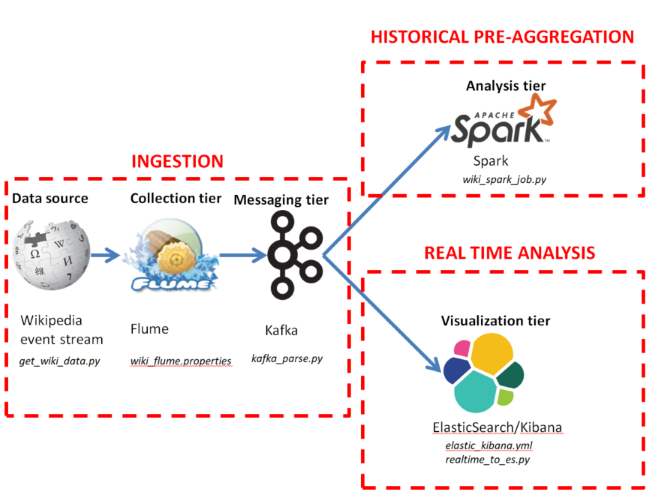
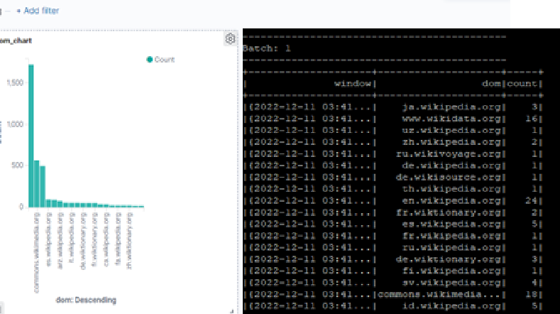
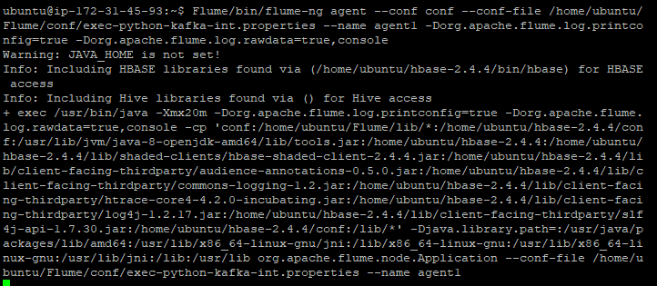
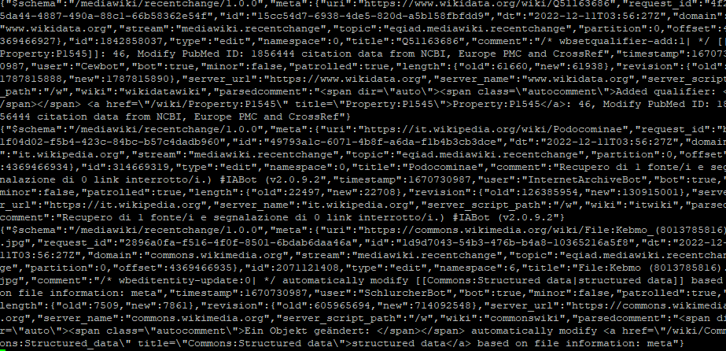
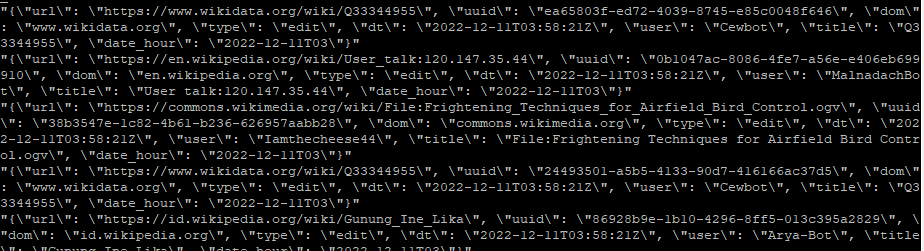
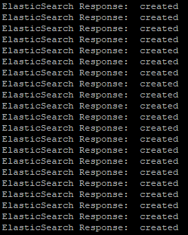

# WikiStream big data pipeline

## Summary
A big data pipeline that ingests changes to Wikimedia (>1k/second) and processes real-time data into Elastic Search and Kibana for visualization and aggregates windowed historical data using Spark.

[A short video walk-through is available here.](https://www.youtube.com/watch?v=ASm4N6sk12U)


_Originally run on an AWS EC2 instance and developed for Harvard University's 'Principles of Big Data Processing' CSCI E-88 Fall 2022_



*Data processing pipeline*

## Data source
[Wikipedia edit stream.](https://wikitech.wikimedia.org/wiki/Event_Platform/EventStreams) See [example.events](example.events) for more.

```
event: message
id: [{"topic":"eqiad.mediawiki.recentchange","partition":0,"timestamp":1670732822001},{"topic":"codfw.mediawiki.recentchange","partition":0,"offset":-1}]
data: {"$schema":"/mediawiki/recentchange/1.0.0","meta":{"uri":"https://commons.wikimedia.org/wiki/File:LL-Q1860_(eng)-StuckInLagToad-indiscretion.wav","request_id":"0cbe9b48-09db-401f-9bbe-8cd8e1c6d220","id":"da75cd5f-4dc4-4954-8a88-b5b6d4fec7e4","dt":"2022-12-11T04:27:02Z","domain":"commons.wikimedia.org","stream":"mediawiki.recentchange","topic":"eqiad.mediawiki.recentchange","partition":0,"offset":4369496612},"id":2071131497,"type":"edit","namespace":6,"title":"File:LL-Q1860 (eng)-StuckInLagToad-indiscretion.wav","comment":"/* wbeditentity-update:0| */ Adding structured data: copyright","timestamp":1670732822,"user":"BotMultichillT","bot":true,"minor":false,"patrolled":true,"length":{"old":344,"new":1345},"revision":{"old":713974786,"new":714098323},"server_url":"https://commons.wikimedia.org","server_name":"commons.wikimedia.org","server_script_path":"/w","wiki":"commonswiki","parsedcomment":"‎<span dir=\"auto\"><span class=\"autocomment\">Changed an entity: </span></span> Adding structured data: copyright"}
```
*Sample event*
## Output
Kibana visualizations of data in real time and windowed aggregations of historical data using Spark


*Visualizations in Kibana and Spark job*
## Implementation
### Initialize Kafka

1. Start Kafka daemon

```
zookeeper-server-start.sh -daemon /opt/kafka/config/zookeeper.properties
kafka-server-start.sh -daemon /opt/kafka/config/server.properties
```

2. Create Kafka topics

```
kafka-topics.sh --create \
  --zookeeper localhost:2181 \
  --replication-factor 1 \
  --partitions 1 \
  --topic input_topic

kafka-topics.sh --create \
  --zookeeper localhost:2181 \
  --replication-factor 1 \
  --partitions 1 \
  --topic output_topic
```
### Run Flume agent

1. [get_wiki_data.py](get_wiki_data.py) gets events from Wikistream 
2. Configure Flume using [wiki_flume.properties](wiki_flume.properties) to source events and sink to Kafka topic, 'input_topic' 
3. Run Flume agent

```
Flume/bin/flume-ng agent --conf conf --conf-file /home/ubuntu/Flume/conf/wiki_flume.properties --name agent1
```



*Flume agent running*



*Kafka topic ingesting raw events*


### Parse Kafka topic

[kafka_parse.py](kafka_parse.py) parses events in 'input_topic', processes and outputs them to 'output_topic'

```
Python3 kafka_parse.py
```



*View of Kafka topic with processed events*

### Start ElasticSearch and Kibana

[elastic_kibana.yml](elastic_kibana.yml) runs Docker file start up Elastic Search and Kibana ([see docker image here](https://hub.docker.com/r/nshou/elasticsearch-kibana/))

```
docker-compose -f elastic_kibana.yml up 
```
### Send events to Elastic Search
[realtime_to_es.py](realtime_to_es.py) reads events from Kafka, and indexes them into Elastic Search.



*Events being indexed into Elastic Search*

```
Python3 realtime_to_es.py
```
### Visualize realtime data in Kibana
Create visualizations as desired and add to dashboard

### Process historical data in Spark

1. Spark structured streaming script, [wiki\_spark\_job.py](wiki_spark_job.py), takes events from Kafka’s 'output_topic' and performs aggregations (ex. count event’s by domain, by minute
2. Run Spark job ([see docker image here](https://github.com/godatadriven-dockerhub/pyspark))

```
docker run -v $(pwd):/job godatadriven/pyspark --packages org.apache.spark:spark-sql-kafka-0-10_2.12:3.1.1,org.apache.kafka:kafka-clients:2.6.1 /job/samples/wiki_spark_job.py
```

## Areas for development
- Run project across multiple servers
- Add more visualizations of the real time data in Kibana
- Store output from Spark in a data storage like HDFS
- Index output from Spark into ElasticSearch and visualize it in Kibana

 
